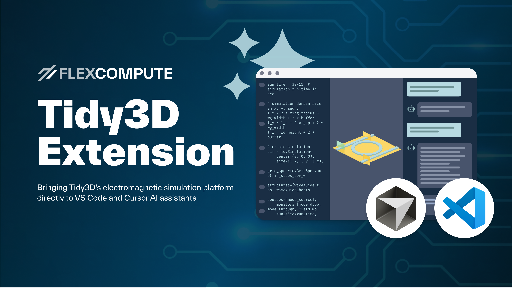

# Tidy3D + AI

*Ushering in a new era of AI-assisted photonic design*

We are pleased to announce the release of the new Tidy3D Extension, which enables seamless building, visualization, and iteration on electromagnetic simulations within Visual Studio Code or Cursor. The extension automatically detects simulations in Tidy3D Python scripts and notebooks, opens an interactive 3D viewer alongside your code, and enables the IDE AI assistant to leverage the integrated FlexAgent MCP server for an intelligent, physics‑aware assistance experience.

## Key Components

### FlexAgent MCP

[FlexAgent MCP](FlexAgent.md) is a physics-aware AI assistant that understands Tidy3D workflows and electromagnetic simulation concepts. Unlike generic coding assistants, FlexAgent provides specialized knowledge and can control the 3D Viewer to provide comprehensive, context-aware support.

**Key Capabilities:**
- **Natural Language Interaction** – Build, modify, and analyze simulations using plain English
- **Physics-Aware** – Understands electromagnetic simulation concepts and Tidy3D's API
- **Learning & Troubleshooting** – Get explanations and fix simulation issues
- **Code Generation** – Create complete simulation setups from scratch
- **Result Analysis** – Interpret and visualize simulation data

### 3D Viewer

The [3D Viewer](3DViewer.md) provides interactive, real-time visualization of Tidy3D simulations directly within your IDE. It automatically detects simulation objects in your code and opens alongside your editor, providing immediate visual feedback as you develop.

**Key Features:**
- **Automatic Detection** – Identifies `Simulation` objects and opens automatically
- **Live Synchronization** – Updates instantly when you modify code
- **Interactive Navigation** – Rotate, zoom, and pan to explore simulations
- **AI-Controlled** – FlexAgent can navigate and explain the 3D scene
- **Comprehensive Visualization** – View structures, sources, monitors, and boundaries

## Video Demos

Watch these demonstration videos to see Tidy3D + AI capabilities in action. Each video showcases specific workflows and features that highlight how FlexAgent MCP and the 3D Viewer can accelerate your photonic design process.

- **[Mode Analysis](https://youtu.be/dQMGgQr_6KE?si=fUXlMEjk2RHCEWjF)** – Learn how to use AI assistance to perform mode analysis and understand waveguide modes

- **[Data Analysis](https://youtu.be/CLFoePrHcjM?si=j7izF3RF1rV7HpO_)** – See how FlexAgent helps analyze simulation results and extract meaningful insights from your data

- **[Convergence Test](https://youtu.be/fhfi4U2HKbo?si=rLo9Fgg-Zv-pJUKV)** – Discover how to set up and run convergence tests with AI guidance to ensure simulation accuracy

- **[Cost Estimation](https://youtu.be/ZuZVu7yA6DQ?si=YNWn9RB3Thmph62a)** – Understand how to estimate simulation costs and optimize your computational resources with AI assistance

For more comprehensive tutorials and the complete video series, visit our [Tidy3D + AI Video Playlist](https://www.youtube.com/playlist?list=PL7kxN4u_N9HHb1QBPXhTlYEMjIt2SY1re).
